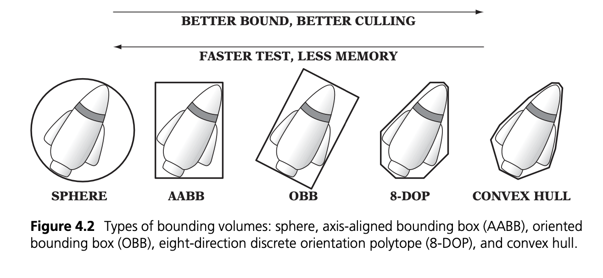
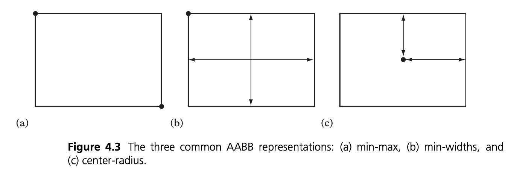

== Preliminaries

**Bounding Volumes:** it's a single simple volume encapsulating one or several objects of more complex nature. The idea is that they have way cheaper overlap tests than the complex ones, very useful when calculating the Ray-Object intersections during traversal. This will result in very fast overlapping rejections.

[]

== Axis-Aligned Bounding Boxes

There are 3 main manners of defining such boxes. The overlap tests are straightforward: 2 AABBs only overlap if they overlap on all 3 (or 2 in 2D) axes.

[]

----
ADD CODE SAMPLES FOR THE INTERSECTION TESTS
----

== Oriented Bounding Boxes

----
ADD COMPLETE DEFINITION AND INTERSECTION TESTS
----

== Summary

Since we want to be able to represent in a realistic manner our buildings, trees, etc., and the existing architecture is already a triangular mesh, using these will save time. These are simpler forms than the buildings and several methods exist to check for ray-triangle collision. Having the center of the triangle, its boundaries and orientation, using parametric equations for the rays path can indicate if a collision appears. Such methods are also available when coding in NVidia's Optix API using their ray-tracing capabilities in C++ and CUDA. Using triangles is also recommended for the OptiX integration since the Model represents either an acceleration structure or a set of triangles, in this instance our buildings. Refer to the link:https://raytracing-docs.nvidia.com/optix6/guide_6_5/index.html#prime#optix-prime-low-level-ray-tracing-api[Optix Programming Guide] or to <<raytracing.adoc, Ray-Tracing>> for more information.